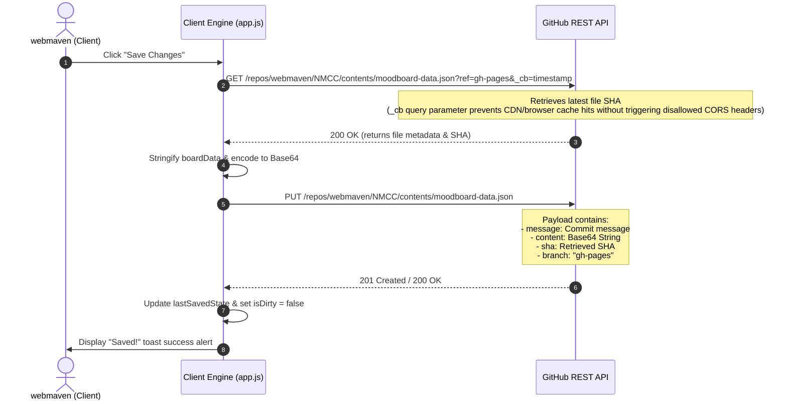

# Technical Developer Guide — Curator Studio (gh-pages)

This guide documents the architecture, state systems, math formulas, gesture handlers, and persistence mechanics of the **Curator Studio (Cherokee Inspiration Mood Board)** application. It is designed to onboard human developers and agentic AI systems to maintain or extend this codebase efficiently.

---

## 🗺️ Architectural Philosophy

The app is built upon a **zero-dependency, high-performance web-native architecture**. It runs entirely in the client's browser, prioritizing lightweight asset overhead, layout fluidness, and immediate user responsiveness.

- **Structure (`index.html`):** Semantic HTML5, containing overlays for dialog modals, navigation headers, a canvas viewport, and a status HUD.
- **Styling (`style.css`):** Built with CSS custom properties (variables), a dark carbon-studio palette (`#0c0e11`), flexible layouts (Flexbox and Grid), responsive CSS queries, and premium glassmorphism effects (`backdrop-filter`).
- **Engine (`app.js`):** Modular ES6 JavaScript coordinating DOM injection, scale-invariant interaction physics, in-memory state tracking, undo/redo stacks, and GitHub Content API synchronizations.

---

## 📊 Core State Management

The client state is governed by several synchronized global variables inside `app.js`:

| State Variable | Data Type | Purpose / Description |
| :--- | :--- | :--- |
| `boardData` | `Object` | Stores the active list of board elements under `boardData.assets`. Each asset is an object containing `id`, `type`, `title`, `x`, `y`, `width`, `height`, `z`, and type-specific fields (e.g., `content`, `value`, `url`). |
| `undoStack` | `Array<String>` | An array of stringified `boardData` snapshots representing previous board states. |
| `redoStack` | `Array<String>` | An array of stringified `boardData` snapshots cleared during new actions, but populated during an `undo()`. |
| `lastSavedState` | `String` | A stringified baseline snapshot of `boardData` representing the exact status of the remote file on `gh-pages`. |
| `zoom` | `Float` | The current active viewport scaling multiplier. Clamped between `0.2` (20%) and `3.0` (300%). |
| `selectedTileId` | `String / null` | The unique ID of the card currently selected. Active cards display a gold-bordered border, resize handle, and overhead toolbar. |
| `isDirty` | `Boolean` | Flag indicating whether current `boardData` differs from `lastSavedState`, triggering the pulsing amber save warning. |
| `editingAssetId`| `String / null` | Tracks which card is currently open inside the edit dialog overlay. |

---

## 📐 Coordinate Math & Scale Invariance

When the work canvas is scaled under custom zoom levels (e.g., zoomed out to 50% or in to 200%), standard mouse movements (delta movements in pixels) do not map 1-to-1 to canvas coordinates. Moving the mouse by 10 pixels on a 50% scaled canvas should translate into a 20-pixel displacement inside the canvas space. 

To prevent card slippage or pointer drift, all dragging and resizing calculations are **scale-invariant**.

### 1. Dragging Translation Math
When dragging starts, we capture the pointer's initial clientside coordinate (`startX`, `startY`) and the tile's initial position (`startLeft`, `startTop`).

During movement (`mousemove`), the delta displacement on the screen is divided by the active `zoom` multiplier before applying it to the card coordinate:

$$\Delta X_{\text{canvas}} = \frac{X_{\text{client}} - X_{\text{start}}}{\text{zoom}}$$

$$\Delta Y_{\text{canvas}} = \frac{Y_{\text{client}} - Y_{\text{start}}}{\text{zoom}}$$

$$Left_{\text{new}} = \text{startLeft} + \Delta X_{\text{canvas}}$$

$$Top_{\text{new}} = \text{startTop} + \Delta Y_{\text{canvas}}$$

### 2. Resizing Translation Math
Similarly, the new dimensions of an element being scaled from its bottom-right corner must be scale-invariant relative to the starting width and height (`startWidth`, `startHeight`):

$$Width_{\text{new}} = \text{startWidth} + \frac{X_{\text{client}} - X_{\text{start}}}{\text{zoom}}$$

$$Height_{\text{new}} = \text{startHeight} + \frac{Y_{\text{client}} - Y_{\text{start}}}{\text{zoom}}$$

### 3. Boundary Clamping Math
To prevent elements from being dragged off the infinite drafting grid (dimensions: $3200\text{px} \times 2400\text{px}$), coordinates are strictly clamped:

$$0 \le Left_{\text{new}} \le 3200 - Width_{\text{tile}}$$

$$0 \le Top_{\text{new}} \le 2400 - Height_{\text{tile}}$$

Implementation Snippet:
```javascript
let newLeft = Math.max(0, Math.min(3200 - activeTile.offsetWidth, startLeft + dx));
let newTop = Math.max(0, Math.min(2400 - activeTile.offsetHeight, startTop + dy));
```

### 4. Grid Snapping Math
When Grid Snapping is active, candidate coordinates are rounded to the nearest multiple of the grid unit (`20px`):

$$Left_{\text{grid}} = \text{round}\left(\frac{Left_{\text{candidate}}}{20}\right) \times 20$$

$$Top_{\text{grid}} = \text{round}\left(\frac{Top_{\text{candidate}}}{20}\right) \times 20$$

### 5. Alignment Snapping (Smart Guides) Math
When Smart Alignment is active, the candidate box edges and midpoints of the active tile are compared against *nearby* rendered tiles $a \in \text{boardData.assets}$ to prevent visual clutter:
- **Proximity Filter:** Only tiles whose centers are within $800\text{px}$ horizontally and vertically of the active tile's center are evaluated:
  \[\text{abs}(Center X_{\text{active}} - Center X_{\text{target}}) < 800\text{px} \quad \text{and} \quad \text{abs}(Center Y_{\text{active}} - Center Y_{\text{target}}) < 800\text{px}\]
- **Active Points of Interest:**
  - Horizontal: $X_{\text{left}} = Left$, $X_{\text{center}} = Left + \frac{Width}{2}$, $X_{\text{right}} = Left + Width$
  - Vertical: $Y_{\text{top}} = Top$, $Y_{\text{middle}} = Top + \frac{Height}{2}$, $Y_{\text{bottom}} = Top + Height$
- **Target Points of Interest:**
  - Horizontal: $X_{\text{t,left}} = a.x$, $X_{\text{t,center}} = a.x + \frac{a.width}{2}$, $X_{\text{t,right}} = a.x + a.width$
  - Vertical: $Y_{\text{t,top}} = a.y$, $Y_{\text{t,middle}} = a.y + \frac{a.height}{2}$, $Y_{\text{t,bottom}} = a.y + a.height$

If the absolute difference is within the threshold ($8\text{px}$), the position is snapped to align, and a guide line (`.smart-guide-v` or `.smart-guide-h`) is appended directly to `#board` at the matched target coordinate. Alignment snapping takes precedence over grid snapping.

---

## 🖱️ Gesture & Keyboard Normalization

### 1. Trackpad Pinch-to-Zoom Gesture
Modern browsers translate trackpad pinch gestures into `wheel` events with the `ctrlKey` modifier set to `true`. We register a passive-false listener to capture and override this behavior, translating the scroll delta into zoom actions:

```javascript
viewport.addEventListener('wheel', (e) => {
  if (e.ctrlKey || e.metaKey) {
    e.preventDefault();
    const zoomIntensity = 0.05;
    let newZoom = zoom + (e.deltaY < 0 ? zoomIntensity : -zoomIntensity);
    setZoom(newZoom);
  }
}, { passive: false });
```

### 2. Form Input Keyboard Shielding
To prevent canvas control event listeners (like hitting `Backspace` to delete cards or `Cmd+Z` to undo) from firing while a user is typing inside descriptions, text fields, or input search boxes, the listener performs active shielding checks:

```javascript
document.addEventListener('keydown', (e) => {
  const isEditingText = document.activeElement.tagName === 'INPUT' || 
                        document.activeElement.tagName === 'TEXTAREA';
  
  if (e.key === 'Backspace' && selectedTileId && !isEditingText) {
    deleteTile(selectedTileId);
  }
  // Other canvas shortcuts are guarded similarly
});
```

---

## 🔒 Persistence & GitHub REST API Integration

Persistence is completely automated without needing a custom database server, by utilizing client-side commits directly to the remote `gh-pages` branch.



### Authentication Token (PAT)
To bypass GitHub API write restrictions for the repository owner (`webmaven`), the app prompts for a fine-grained Personal Access Token (PAT). 
- **Storage:** Stored locally in the user's browser using `localStorage.setItem('gh_pat', token)`.
- **Security:** The token is sent directly to the official `api.github.com` endpoints via HTTP Headers (`Authorization: token <PAT>`) and is never routed through, or logged by, any third-party intermediate servers.

---

## 🧩 Element templates and Dynamic DOM Rendering

Each element inside `boardData.assets` maps to a tile element injected inside `#board` using `createTileDOM(asset)`.

Every card template contains three interactive handles and controls:
1. **✏️ Edit (Card Header):** Labeled button, instantly discoverable, opens edit overlay with pre-populated fields.
2. **▲ / ▼ Layer Order (Toolbar):** Moves elements frontward/backward by rewriting the global array indices and rebuilding `z-indices`.
3. **🗑️ Delete (Toolbar):** Drops element from array and registers action onto the Undo history stack.

---

## 📁 Project File Map (gh-pages branch)

```text
├── index.html               # Main entry page containing layout grid, HUD, and modal containers.
├── style.css                # Component visual classes, glassmorphism tokens, and interactive hover transitions.
├── app.js                   # Application state engine, scale-invariant interaction physics, and GitHub sync logic.
├── moodboard-data.json      # Pre-populated raw database file containing color, texture, and cultural cards.
├── AGENTS.md                # This technical guide.
└── assets/                  # Fine-art generated assets representing Cherokee traditions.
    ├── cherokee_basket.png  # Double-weave rivercane basket.
    ├── rivercane_weave.png  # High-definition woven split texture.
    ├── cherokee_pottery.png # Hand-coiled pottery styled with wooden-paddle stamps.
    └── cherokee_beadwork.png# Close-up of curvilinear glass seed beadwork.
```

---

## 🔧 Extending the Application

### 1. Adding a New Card Type
To introduce a new card asset type (e.g., Audio clips, Video embeds):
1. Add a new tab option in `#modal-add .type-selector` inside `index.html`.
2. Define a corresponding `.form-section` div container for the input controls in `index.html`.
3. Add a case in `getTypeIcon(type)` and `getTileBodyContent(asset)` inside `app.js` to define its visual rendering.
4. Add input serialization logic to `submitNewElement()` in `app.js` to gather field parameters when creating or updating the card.

### 2. Testing Locally
To test coordinates math and state updates locally:
1. Start a local server: `npx -y http-server -p 8080`
2. Open `http://localhost:8080` in your browser.
3. Use developer tools console to inspect `boardData`, `zoom`, or trigger custom trace testing on `undoStack`.
