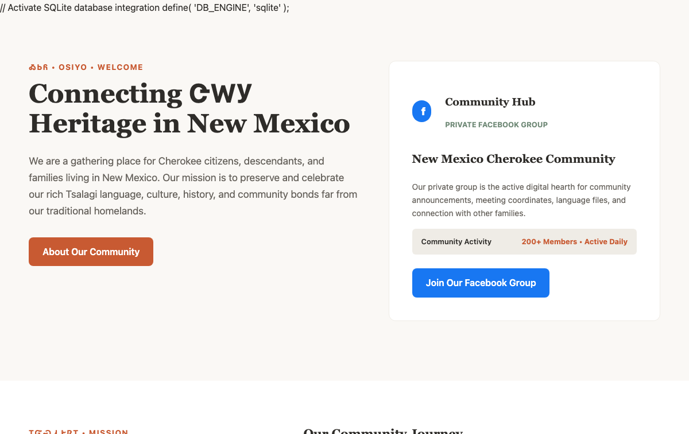
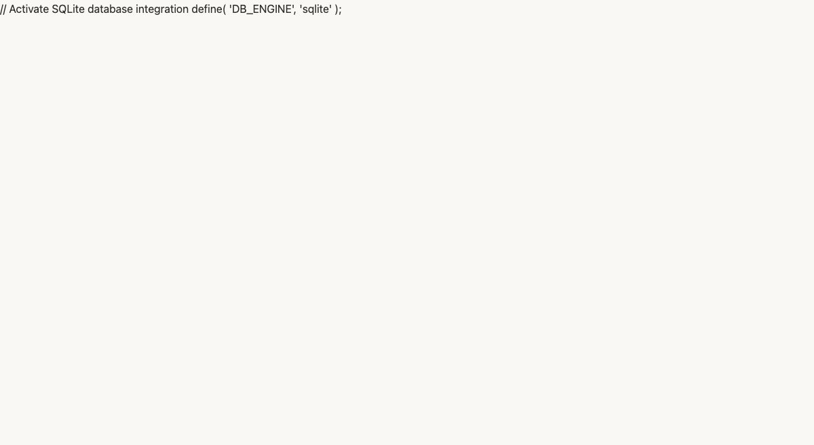
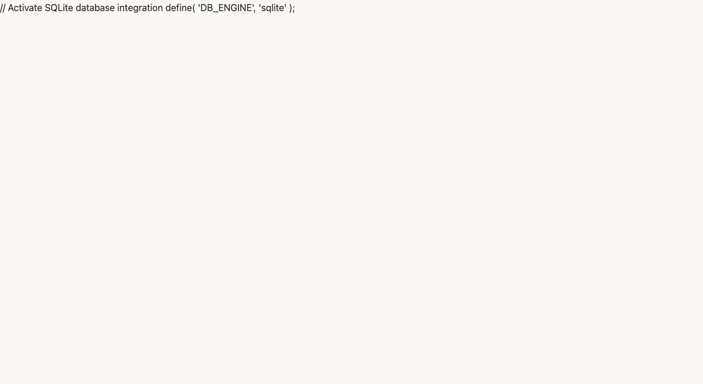

# New Mexico Cherokee Community (NMCC) WordPress Theme



A modern, highly accessible, and semantically robust WordPress Block Theme (Full Site Editing - FSE) built specifically for the **New Mexico Cherokee Community**. 

The theme features a unified English-Cherokee typographic design system, strict editorial guardrails to prevent non-technical editors from breaking layouts, a custom Gutenberg editor extension for mixed bilingual inline text entry, and a native Facebook Group featured posts card feed.

---

## 📖 Table of Contents
1. [Architectural Principles & Layout Locks](#-architectural-principles--layout-locks)
2. [Typographic & Color Design System](#-design-system-typography--colors)
3. [Gutenberg Bilingual Inline Extension](#-gutenberg-bilingual-inline-extension)
4. [Custom Layout Patterns & Facebook Feed](#-custom-layout-patterns--facebook-feed)
5. [Local Development & Testing Suite](#-local-development--testing-suite)
6. [Continuous Integration (GitHub Actions CI)](#-continuous-integration-github-actions-ci)
7. [Dummy-Proof Editor Handoff Guide](#-dummy-proof-editor-handoff-guide)

---

## 🏛️ Architectural Principles & Layout Locks

To guarantee a seamless experience for editors who may be non-technical or tech-phobic, the theme is designed **defensively**. The header, footer, and global page wrappers are configured using locked layouts. This separates the global structural design from content editing, ensuring layout elements cannot be accidentally dragged, moved, or deleted.

### File Structure Map
*   `style.css` — Standard theme metadata header and front-end classes for bilingual rendering.
*   `functions.php` — Theme configuration bootstrap, custom pattern categories, and editor asset hooks.
*   `theme.json` — The master configuration file defining design tokens, styles, and block editor limits.
*   `assets/js/editor.js` — Core Javascript registering our custom Gutenberg bilingual RichText formats.
*   `assets/css/editor-style.css` — Provides visual highlight backgrounds and badges in the editor workspace.
*   `templates/` — Visual full-site templates (`front-page.html`, `page.html`, `single.html`, `404.html`).
*   `parts/` — Locked modular structural segments (`header.html`, `footer.html`).
*   `patterns/` — One-click insertable layout sections containing beautiful placeholder bilingual content.

---

## 🎨 Visual Identity & Style Guide

This repository doubles as the **Official Design System & Visual Identity Handbook** for the New Mexico Cherokee Community. The design was crafted from the ground up to feel warm, organic, grounded, and culturally authentic.

---

### 🧱 Master Color Palette
To prevent accidental design inconsistencies, the block editor restricts administrators strictly to these warm, organic tones:

| Color Token | Hex Code | Visual Sample | Core Purpose |
| :--- | :--- | :---: | :--- |
| **Soft Cream** | `#FAF8F5` | `█████████` | Primary site background; welcoming, high-readability, low screen glare. |
| **Warm Alabaster** | `#EFECE6` | `█████████` | Secondary layout sections, card backgrounds, and panel divisions. |
| **Clay Accent** | `#C85A32` | `█████████` | Warm copper/clay brand color used for primary buttons, active links, and highlights. |
| **Sage Secondary** | `#708A77` | `█████████` | Soft organic green used for badges, categories, date indicators, and metadata. |
| **Warm Charcoal** | `#2E2C29` | `█████████` | High-contrast body copy and interface labels for deep reading accessibility. |

---

### 🔤 Typographic Hierarchy & Metric Alignment
Mixing English text and Cherokee Syllabary inline often causes layout "jumping" and uneven lines because of mismatched script heights. To solve this, the theme maps Google's companion Noto families, which are designed to share identical metrics and vertical colors:
*   **Primary Display (h1 - h4):** `Noto Serif` + `Noto Serif Cherokee` (loaded locally with a remote Google CDN fallback).
    *   *Sizing:* Title (44px, line-height 1.25), Headline (32px, line-height 1.3).
*   **Body & Interface Copy:** `Noto Sans` + `Noto Sans Cherokee`.
    *   *Sizing:* Standard body copy (18px, line-height 1.6, letter-spacing 0.01em).

---

### 🧱 Architectural Guardrails
To prevent editors from accidentally breaking the site's layout or design:
*   **Locked Layout Blocks:** Header, footer, and page structures are locked. Editors can modify content and copy but cannot delete structural frames.
*   **Palette Restrictions:** No custom hex colors, custom gradients, or random text sizing are allowed inside the Gutenberg block editor.

---

## ✍️ Gutenberg Bilingual Inline Extension

The theme enqueues a custom script (`assets/js/editor.js`) that injects two new buttons into the inline Gutenberg toolbar (located next to **Bold** and *Italic* in the formatting popover):

### 1. ᏣᎳᎩ (Cherokee Syllabary)
*   **What it does:** Wraps highlighted syllables in `<span class="cherokee-syllabary" lang="chr">`.
*   **Accessibility & SEO:** Sets the proper language tag (`lang="chr"`), telling screen readers and search engines to interpret the text as Cherokee.
*   **Visual Styling:** Automatically applies the Noto Serif/Sans Cherokee font weights and highlights the syllable in our Clay accent.
*   **Editor Feedback:** Displays a subtle clay background, dotted underline, and a small `ᏣᎳᎩ` badge inside the Gutenberg editor window so the admin knows the text has been successfully tagged.

### 2. Cherokee Translit
*   **What it does:** Wraps highlighted translit words in `<span class="cherokee-translit" lang="chr-Latn">`.
*   **Accessibility:** Sets the standardized BCP 47 language subtag for Cherokee in Latin script (`lang="chr-Latn"`).
*   **Visual Styling:** Automatically applies an elegant, italicized, warm neutral tone.
*   **Editor Feedback:** Displays a soft sage highlight and a `Latn` badge inside the editing interface.

---

## 📱 Custom Layout Patterns & Site Blueprints

We register 5 custom block layouts in the **"New Mexico Cherokee Community"** category. Editors can insert these complete blocks instantly:

### 1. Community Hero & Facebook Bridge (`homepage-hero`)
A striking split hero layout. The left column contains a warm bilingual welcome message, while the right column houses our custom **Facebook Community CTA Card**, displaying live statistics and inviting users to join.


---

### 2. Community Story / About Section (`community-about`)
A gorgeous editorial layout highlighting a Cherokee cultural quote (*ᏗᏣᏓᏩᏛᎯᏓ* • Find one another) and providing a balanced dual-column text layout.



---

### 3. Announcements & Events Grid (`announcements-grid`)
A crisp, reader-friendly cards grid designed for classes, dinners, and gatherings, featuring date tags and quick-links.


---

### 4. Citizen & Cultural Resources (`resource-library`)
A 4-column card list linking community members to official tribal services, language application portals, At-Large voter registration, and the Cherokee Phoenix newspaper.



---

### 5. Facebook Featured Posts Feed (`facebook-posts-feed`)
A 3-column responsive card layout utilizing native WordPress **Embed** blocks.
*   **No API Keys Required:** Unlike heavy plugins that require developer accounts and expire every 60 days, this block leverages WordPress's native oEmbed engine.
*   **To Update the Feed:** Open your Facebook Group, click `...` on a public post -> click **Copy Link**. Then open the WordPress editor, click on a post card, paste your link, and click **Embed**. The card automatically scales and formats the post perfectly inside our theme.


---

## 🛠️ Local Development & Testing Suite

The theme features a comprehensive automated testing suite and an optimized local live-reload design environment.

### 💻 Local Design & Live-Reload Server

To see your design changes instantly in the browser without manual refreshing:

1. **Setup WordPress locally (One-time only):**
   Downloads WordPress Core, configures a lightweight SQLite database, and symlinks our active theme folder:
   ```bash
   python3 bin/setup-wp.py
   ```
2. **Start the Live-Reload Development Server:**
   Launches the local SQLite PHP server and starts BrowserSync concurrently to watch all files, opening your browser at `http://localhost:3000`:
   ```bash
   npm run dev
   ```
Now, whenever you edit design tokens (`theme.json`), stylesheets (`assets/css/**/*.css`), block templates (`templates/**/*.html`), or Gutenberg editor scripts, BrowserSync will **instantly inject styles or hard-reload the browser** automatically!

### Prerequisites
Make sure you have Node.js, Python 3, and PHP installed. Run the dependency installations:
```bash
# Install Node, Jest, and BrowserSync dependencies
npm install

# Install Composer dependencies for PHPUnit testing
composer install
```

### Running Tests Locally

#### 1. JavaScript Unit Tests (Jest)
Tests the Gutenberg format registration routines to guarantee that the custom inline bilingual styles bind the correct HTML tags, class names, and `lang` attributes:
```bash
npm run test
```

#### 2. Structural & FSE Integrity Tests (Python)
An automated Python linter that parses `theme.json` syntax and recursively checks all FSE block templates in `templates/` and `parts/` to ensure all Gutenberg HTML comment blocks (`<!-- wp:... -->` and matching closing tags) are structurally balanced:
```bash
python3 bin/run-tests.py
```

#### 3. WordPress Integration Tests (PHPUnit)
Verifies that all theme actions, pattern categories, and scripts are successfully registered in the WordPress hook lifecycle:
```bash
# Set up a local test database and run PHPUnit
vendor/bin/phpunit
```

---

## 🚀 Continuous Integration (GitHub Actions CI)

We include a complete GitHub Actions CI pipeline (`.github/workflows/ci.yml`) that triggers on every push and pull request to the `main` branch. 

It splits into three parallel jobs:
1.  **Javascript Testing:** Boots a Node runner, runs ESLint, and executes our Jest test suite.
2.  **Structural Testing:** Boots a Python runner and runs the `run-tests.py` script to verify `theme.json` and block template comment nestings.
3.  **WordPress PHPUnit Testing:**
    *   Spawns a live, disposable `mysql:5.7` service container.
    *   Installs PHP 8.1 with mandatory database extensions.
    *   Downloads and configures the official WordPress Core and tests suite.
    *   Integrates `wp-tests-config.php` linked to the MySQL service.
    *   Executes `phpunit` to verify PHP lifecycle integrations.

---

## ✏️ Dummy-Proof Editor Handoff Guide

Provide this simple 3-step guide to the next community administrator to ensure an unbreakable editing experience:

### 1. How to Edit Text
- Go to **Pages** -> Click **Edit** on any page.
- Click directly on any text or title and type over it like a word processor.
- Click **Update** in the top right corner.

### 2. How to Highlight Cherokee Words Inline
- Type your Cherokee words or syllables (e.g. `ᏣᎳᎩ`).
- Highlight the syllables with your mouse.
- Click the **arrow dropdown** in the formatting toolbar -> Select **ᏣᎳᎩ (Cherokee Syllabary)**.
- You will see a small badge appear in your editor. This guarantees the word is tagged correctly for search engines and look beautiful to visitors!

### 3. How to Update the Facebook Feed
- Visit the Facebook group and locate the public announcement post.
- Click the three dots (`...`) in the corner of the post and select **Copy Link**.
- Go to the WordPress editor, click on one of the cards in your highlights feed, click **Edit**, paste your link, and click **Embed**.
- The post is updated and formatted automatically!
